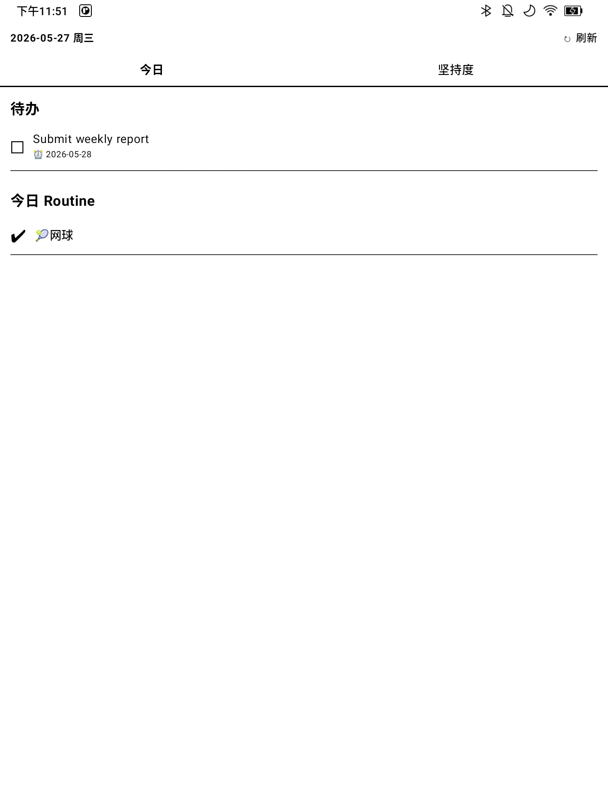
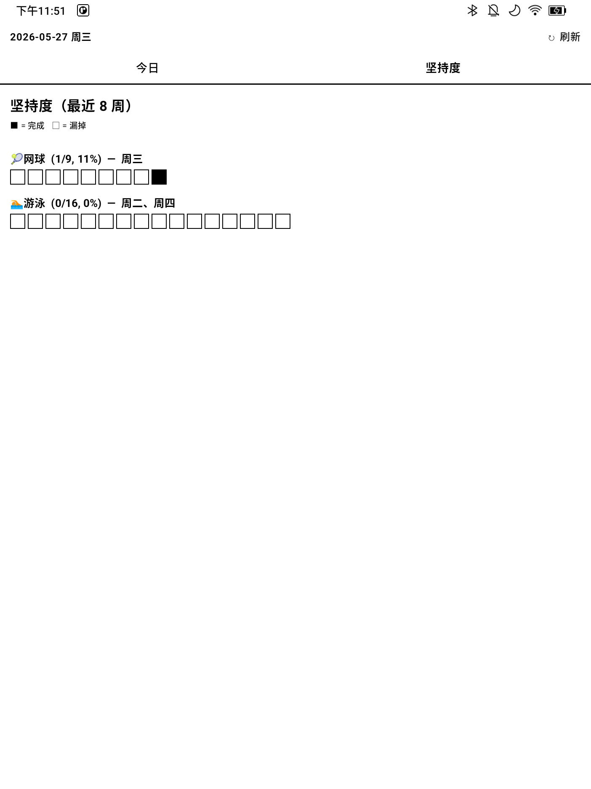

# Boox Daily Todo

A daily to-do list and weekly-routine habit tracker for the **Onyx Boox Note X3 Plus** — a 10.3" Android 11 **e-ink** tablet.

Manage your tasks conversationally from your computer, check them off on the e-reader, and watch your habit streaks build — all kept in sync through a single cloud database.

> The on-device UI is localized in Chinese (the author's daily-use language). English glosses are provided in the captions below.

## Screenshots

| Today — tasks & routines | Adherence — habit chart |
| :---: | :---: |
|  |  |
| *"待办" = To-do · "今日 Routine" = Today's routines · tap a row to complete it* | *"坚持度" = Adherence · filled = done, empty = missed, per scheduled day over 8 weeks* |

## Features

- **Conversational task management** — add / complete / delete tasks and routines by chatting with an assistant on your computer; the e-reader updates within seconds.
- **Bidirectional sync** — tap a task on the Boox and it's written straight back to the database.
- **Weekly routines** — recurring habits like *tennis every Wednesday* or *swimming on Tuesday & Thursday*.
- **Adherence visualization** — a per-routine grid (à la GitHub contribution graph) showing exactly which scheduled days were kept.
- **E-ink–optimized UI** — pure black & white, high contrast, large touch targets, no animations or ripples (avoids ghosting), manual + on-resume + 60 s polling refresh instead of battery-hungry websockets.

## Architecture

A single cloud database (**Supabase / Postgres**) is the source of truth. Two clients read and write it: a tiny command-line tool driven from chat, and the on-device Android app.

```
  You (chat)                 Supabase (Postgres)            Boox app (Kotlin/Compose)
 "add a report"   ── writes ─▶ ┌──────────────┐ ◀── reads ──  today list
  scripts/todo.py             │  tasks        │              tap = complete  ─┐
                              │  routines     │                               │
       reads ◀────────────── │  routine_logs │ ◀──────────── writes ─────────┘
                              └──────────────┘
                            REST API (PostgREST) + RLS
```

## Tech stack

| Layer | Technology |
| --- | --- |
| Mobile app | Kotlin, Jetpack Compose (Material 3), Coroutines, OkHttp, kotlinx.serialization |
| Backend | Supabase — Postgres + auto-generated PostgREST API, Row-Level Security |
| Assistant CLI | Python (standard library only — no dependencies) |
| Build / tooling | Gradle 8.7, Android Gradle Plugin 8.5.2, JDK 17, `adb` |

## Project structure

```
.
├── android/              Boox Android app (Kotlin + Jetpack Compose)
│   └── app/src/main/java/com/boox/dailytodo/
│       ├── Models.kt         data models (Task / Routine / RoutineLog)
│       ├── Repository.kt     Supabase REST client
│       ├── MainViewModel.kt  state + polling + sync
│       ├── MainActivity.kt   tabs (Today / Adherence)
│       └── ui/               Compose screens + e-ink theme
├── scripts/
│   ├── todo.py               assistant-side CLI (add/done/rm, routines, stats)
│   └── capture_screenshots.sh  refreshes docs/screenshots from a connected Boox
├── supabase/schema.sql       database schema (tasks / routines / routine_logs)
├── docs/screenshots/         README screenshots (auto-updated, see below)
├── .githooks/pre-commit      refreshes screenshots on every commit
└── .env.example              configuration template
```

## Getting started

### 1. Backend (Supabase)

1. Create a free project at [supabase.com](https://supabase.com).
2. Run [`supabase/schema.sql`](supabase/schema.sql) (SQL Editor, or `psql` with the connection string) to create the tables, indexes, and RLS policies.

### 2. Configuration

```bash
cp .env.example .env
# Fill in SUPABASE_URL and SUPABASE_ANON_KEY (publishable key) from
# Supabase → Project Settings → API.
```

The same `.env` is read by the CLI and injected into the app at build time (via `BuildConfig`). Secrets stay out of source control.

### 3. Assistant CLI

```bash
python3 scripts/todo.py today
python3 scripts/todo.py task add "Submit weekly report" --due tomorrow
python3 scripts/todo.py task done "report"
python3 scripts/todo.py routine add Tennis --days wed --icon 🎾
python3 scripts/todo.py routine add Swim   --days tue,thu --icon 🏊
python3 scripts/todo.py routine log Tennis            # check in for today
python3 scripts/todo.py routine stats --weeks 8       # text adherence report
```

### 4. Build & install the app

```bash
export JAVA_HOME=$(/usr/libexec/java_home -v 17)   # or your JDK 17 path
cd android
./gradlew assembleDebug
adb install -r app/build/outputs/apk/debug/app-debug.apk
```

### Boox-specific notes

Onyx Boox aggressively manages third-party apps. After installing:

- **Unfreeze the app** — Boox freezes newly installed apps (`PackageManager` reports `enabled=3`), so it won't launch. Exclude it in **Settings → Apps (App Management) → Freeze settings**, or run `adb shell pm enable com.boox.dailytodo`.
- **Allow network** — make sure the app is enabled under **App Management → Allow app network access**.
- **USB debugging** lives under **Settings → Apps → USB Debug Mode**, *not* the standard "tap Build number" flow.

## Screenshot automation

The screenshots in this README are refreshed automatically. A versioned git hook
([`.githooks/pre-commit`](.githooks/pre-commit)) runs
[`scripts/capture_screenshots.sh`](scripts/capture_screenshots.sh) before every commit:
if a Boox is connected over USB it captures the **Today** and **Adherence** screens into
`docs/screenshots/` and stages them; if no device is connected it's a no-op.

Enable it once after cloning:

```bash
git config core.hooksPath .githooks
```

## License

MIT — see [LICENSE](LICENSE).
